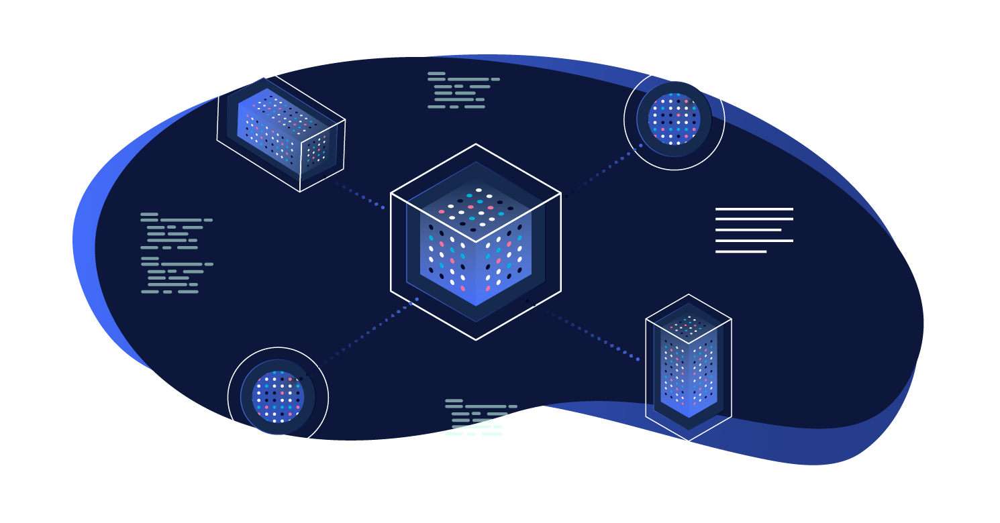

# Core



The core module provides the entry point for platform code. It includes functionality for retrieving information about the current environment, the module registry, plus parsing and reading the project configuration.

**Note:** all functions documented below are under the `Altis` namespace.

## Environment

The following functions are available to use at any point on or after the `altis.autoloader_loaded` action.

**`get_environment_name() : string`**

Returns the current hosting stack name based on the `HM_ENV` constant. On local setups this will return `unknown`.

**`get_environment_type() : string`**

Returns one of `local`, `development`, `staging` or `production`. This is read from the `HM_ENV_TYPE` constant except on local setups.

**`get_environment_region() : ?string`**

Returns the current AWS application's region based on the `HM_ENV_REGION` constant. On local setups or if the region is not set this will return `null`. The region can be `us-east-1`, `ap-northeast-1`, `eu-central-1` etc.

**`get_environment_architecture() : string`**

Returns the current server architecture, currently this is one of `ecs` or `ec2`. `ec2` is the legacy architecture while `ecs` is the new container based system.

**`get_environment_codebase_revision() : string`**

Returns the current revision of the codebase deployed to the current environment. This will be the GIT commit hash of the latest commit that was deployed in the most recent deploy.

## AWS SDK

The AWS SDK is always available and preconfigured with the necessary credentials on all non local servers. Access to additional APIs can be requested if needed.

**`get_aws_sdk() : Aws\Sdk`**

Returns an instance of the base AWS SDK with preconfigured credentials.

The credentials can be supplied by providing the `modules.core.aws` setting in the configuration. It's recommended that this be done only for the local environment:

```
{
	"extra": {
		"altis": {
			"environments":{
				"local": {
					"modules": {
						"core" : {
							"aws":{
								"region": "us-east-1",
								"key": "xxxxxxxxxxxxxxxxxxxx",
								"secret: "xxxxxxxxxxxxxxxxxxxxxxxxxx"
							}
						}
					}
				}
			}
		}
	}
}
```

The AWS SDK can be also configured in code by using `altis.aws_sdk.params` filter which is called right before the global instance of the AWS SDK is created.

**Note:** this filter can only be used in the bootstrap function of an Altis module as it's called very early in the loading process.

```php
add_filter( 'altis.aws_sdk.params', 'aws_sdk_params' );

function aws_sdk_params( array $params ) : array {
	$params['region'] = 'new_region';
	return $params;
}
```

## Autoloader

For convenience, an autoloader which follows the WordPress class file naming standard is available. This can be used in code following the WordPress file naming standards; if using PSR-based standards, we recommend using the Composer autoloaders instead.

**`register_class_path( string $prefix, string $path ) : void`**

Registers the given prefix to be autoloaded from the given path. The prefix can either be a legacy-style class prefix (e.g. `Altis_CMS_`) or a namespace (e.g. `Altis\CMS`).

Classes are mapped to paths through the following process:

1. The prefix is removed from the class name
2. The class name is lower-cased
3. If the class name contains namespace separators, these are converted to directory separators
4. Underscores in the class name (but not the parent namespace) are converted to dashes
5. The name is prefixed with `class-`

For example, with `register_class_path( 'Altis\CMS', '/dir' )`, the class `Altis\CMS\Alpha_Beta\Gamma_Delta` would be expected to live at `/dir/alpha_beta/class-gamma-delta.php`.


## Configuration

The configuration for the project determines which modules are loaded and how they behave. It can also be used for arbitrary project configuration.

### Functions

**`get_config() : array`**

Returns the complete configuration for the project including modules and their defaults and any overrides from the root `composer.json` configuration.

### Filters

These filters are intended for use by autoloaded files in modules and must be hooked into early. They provide a means of adding additional configuration features such as per environment overrides and configuration post-processing.

**`altis.config.default : array $default_config`**

Filters the default base config to merge defaults and overrides into.

**`altis.config : array $config`**

Filters the final config returned by `get_config()`.

**`altis.aws_sdk.params : array $params`**

Filters the final parameters used for creating the global instance of the AWS SDK accessed via `Altis\get_aws_sdk()`.

See [the AWS SDK documentation for the full list of available options](https://docs.aws.amazon.com/aws-sdk-php/v3/api/class-Aws.AwsClient.html#___construct).

## Modules

Note that the modules interface is intended for internal use only and is documented here for completeness.

### Functions

**`register_module( string $slug, string $directory, string $title, ?array $default_settings, ?callable $loader ) : Module`**

Registers and returns a `Module` object. If the module setting `enabled` is true the loader callback will be run on the `altis.modules.<slug>.loaded` action hook.

This function must be called on the `altis.modules.init` action hook.

**`get_enabled_modules() : array`**

Returns an array of `Module` objects with their `enabled` setting set to `true`.

### Actions

**`altis.modules.init`**

Fired after the autoloader has been included. Modules can only be registered on this hook.

**`altis.modules.<slug>.loaded : Module $module`**

Used to fire a module's registered loader callback. Receives the `Module` object registered with the corresponding slug as an argument.
