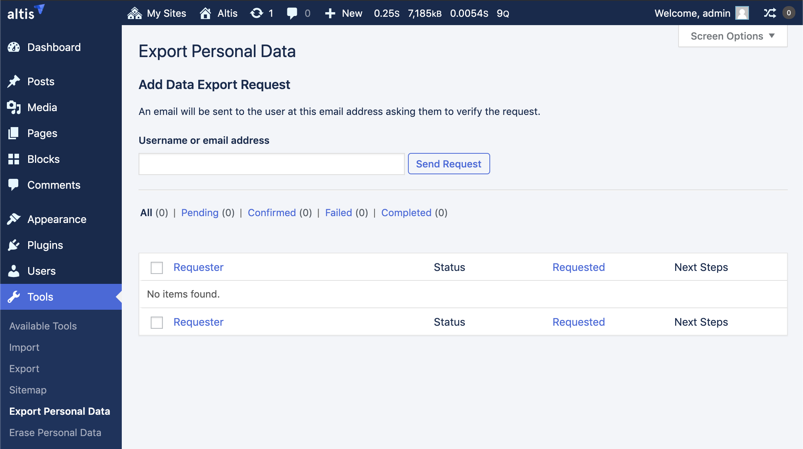

# Privacy API

The CMS provides extensible privacy tools including a default privacy policy page and hooks for additional code to suggest content for it, as well as the ability to register user data export and deletion callbacks.

## Privacy Policy Page

The privacy policy page is automatically generated as a draft with basic information related to the operation of the CMS along with headings for sections that should be filled out with more detailed information such as what analytics and trackers are running on the site.

[The default page is available to edit here](internal://admin/post.php?post=3&action=edit).

Before launching a site it is important to fill out this page and publish it.

The standard content hierarchy is as follows:

- Who we are
- What personal data we collect and why we collect it
  - Comments
  - Media
  - Contact forms
  - Cookies
  - Embedded content from other websites
  - Analytics
- Who we share your data with
- How long we retain your data
- What rights you have over your data
- Where we send your data
- Your contact information
- Additional information
  - How we protect your data
  - What data breach procedures we have in place
  - What third parties we receive data from
  - What automated decision making and/or profiling we do with user data
  - Industry regulatory disclosure requirements

### Using an Existing or Alternative Page

Under the [Settings > Privacy admin menu item](internal://admin/privacy.php) it is possible to select which page you would like to use as the privacy policy page.


The Privacy Policy page ID is stored as an option:

```php
$privacy_page_id = get_option( 'wp_page_for_privacy_policy' );
```

## Suggesting Privacy Policy Content

**`wp_add_privacy_policy_content( string $identifier, string $policy_text )`**

This function will provide an editor working on the privacy policy page with prompts for content they can add and the code or feature it relates to. The text should aim to answer one of the default headings described above.

If you need to provide information that fits under multiple sections you can make multiple calls to this function to make it easier for editors to pull out the relevant content where needed.

It is recommended to link out to any 3rd party privacy policies where relevant.

```php
// Must be called on the `admin_init` hook.
add_action( 'admin_init', function () {
	$policy_text = sprintf(
		__( 'The Google Analytics feature collects information
			about your browser and how you interact with the website.
			If you are logged in this information may be associated with
			your account. You can learn more by visiting the
			<a href="%s">Google Privacy Policy</a> page.'
		),
		'https://policies.google.com/privacy?hl=en'
	);
	wp_add_privacy_policy_content( 'google-analytics', $policy_text );
} );
```

## Personal Data Exports

When a user makes a request for an export of their personal data a confirmation request should be sent to them via the [Export Personal Data tool](internal://admin/tools.php?page=export_personal_data) by filling in their email address and clicking send.



Once they have confirmed their request a zip file is created and emailed to them.

### Extending Personal Data Export

By default the export will contain any data known to be associated with the requester's email address such as comments or posts. Some code may extend the platform in such a way that it cannot determine all the data associated with the user automatically.

To extend the data export use the `wp_privacy_personal_data_exporters` filter:

```php
add_filter( 'wp_privacy_personal_data_exporters', function ( array $exporters ) : array {
	$exporters['form-responses'] = [
		'exporter_friendly_name' => __( 'Form Response Exporter' ),
		'callback' => 'form_response_exporter',
	];
	return $exporters;
} );
```

The `form_response_exporter` callback function receives the requester's email address and is responsible for collecting the custom data.

The function should paginate results to avoid timeouts and performance issues. To help with this core checks the value of `done` in the returned array and if false will call the function again with the `$page` argument incremented by 1.

The following example exports data from a hypothetical `form_responses` custom post type:

```php
function form_response_exporter( string $email, int $page = 1 ) : array {

	$export_items = [];

	// Fetch form responses from this email address.
	$responses = new WP_Query( [
		'posts_per_page' => 300,
		'paged' => $page,
		'post_type' => 'form_responses',
		'meta_key' => 'email',
		'meta_value' => $meail,
	] );

	foreach ( $responses->posts as $post ) {
		// Most item IDs should look like postType-postID
		// If you don't have a post, comment or other ID to work with,
		// use a unique value to avoid having this item's export
		// combined in the final report with other items of the same id.
		$item_id = sprintf( 'form-responses-%d', $post->ID );

		// Core group IDs include 'comments', 'posts', etc.
		// But you can add your own group IDs as needed.
		$group_id = 'form-responses';

		// Optional group label. Core provides these for core groups.
		// If you define your own group, the first exporter to
		// include a label will be used as the group label in the
		// final exported report.
		$group_label = __( 'Form Responses' );

		// Add as many items in the item data array as needed.
		$data = [
			[
				'name' => __( 'Message' ),
				'value' => $post->post_content,
			],
			[
				'name' => __( 'Interests' ),
				'value' => implode( ', ', get_post_meta( $post->ID, 'interests' ) ),
			],
			// ... more fields ...
		];

		// Exported items must match this array structure.
		$export_items[] = [
			'group_id' => $group_id,
			'group_label' => $group_label,
			'item_id' => $item_id,
			'data' => $data,
		];
	}

	// Must return an array of data and a "done" flag.
	return [
		'data' => $export_items,
		'done' => $responses->have_posts(),
	];
}
```

## Erasing Personal Data

Following a similar mechanism to the personal data export should a user request that their personal data be deleted you can send a confirmation email to them via the [Tools > Erase Personal Data page](internal://admin/tools.php?page=remove_personal_data).

Once confirmed all known data associated with their email address will be deleted. Note the data deleted does not extend to any backups as those are not covered under "making a reasonable effort to remove all data" in accordance with GDPR.

Should a site ever need to be restored from a backup it is important to go back through previous data removal requests and ensure the data was either already removed or to remove it again.

### Extending Personal Data Erasers

Again via a similar mechanism to the data export custom code can provide a means to remove personal data.

A date deletion callback can be registered via the `wp_privacy_personal_data_erasers` filter:

```php
add_filter( 'wp_privacy_personal_data_erasers', function ( array $erasers ) : array {
	$erasers['form_response_eraser'] = [
		'eraser_friendly_name' => __( 'Form Response Eraser' ),
		'callback'             => 'form_response_eraser',
	];
	return $erasers;
} );
```

The following example shows the deletion of the hypothetical `form_responses` custom post type from earlier and takes the exact same arguments of email address and page:

```php
function form_response_eraser( string $email, $page = 1 ) : array {

	// Fetch form responses from this email address.
	$responses = new WP_Query( [
		'posts_per_page' => 300,
		'paged' => $page,
		'post_type' => 'form_responses',
		'meta_key' => 'email',
		'meta_value' => $meail,
	] );

	$items_removed = 0;
	$items_retained = 0;
	$messages = [];

	foreach ( $responses->posts as $post ) {
		// Force detete the post.
		$success = wp_delete_post( $post->ID, true );

		if ( $success ) {
			$items_removed++;
		} else {
			$items_retained++;
			$messages[] = sprintf( __( 'Form Response ID %d could not be deleted.' ), $post->ID );
		}
	}

	return [
		// Number of items removed.
		'items_removed' => $items_removed,
		// Number of items retained.
		'items_retained' => $items_retained,
		// Optional messages for response.
		'messages' => $messages,
		// Whether we have more data to go through.
		'done' => $responses->have_posts(),
	];
}
```

## Filters

**`user_request_action_confirmed_message : string`**

Allows modifying the confirmation email text sent to the user.

**`wp_privacy_export_expiration : int`**

Allows modifying the time in seconds to retain generated export files for. Defaults to 3 days.

**`wp_privacy_personal_data_email_content : string`**

Allows modifying the email text sent to users with their data export download link.

## Capabilities

The privacy features have some custom capabilities allowing for non-admins or custom user roles to be able to manage personal data exports and deletion.

**`erase_others_personal_data`**

Controls whether the user can access the erase data screen under Tools in the admin.

**`export_others_personal_data`**

Controls whether the user can access the export data screen under Tools in the admin.

**`manage_privacy_options`**

Controls whether the user can set the privacy policy page under Settings > Privacy in the admin.
